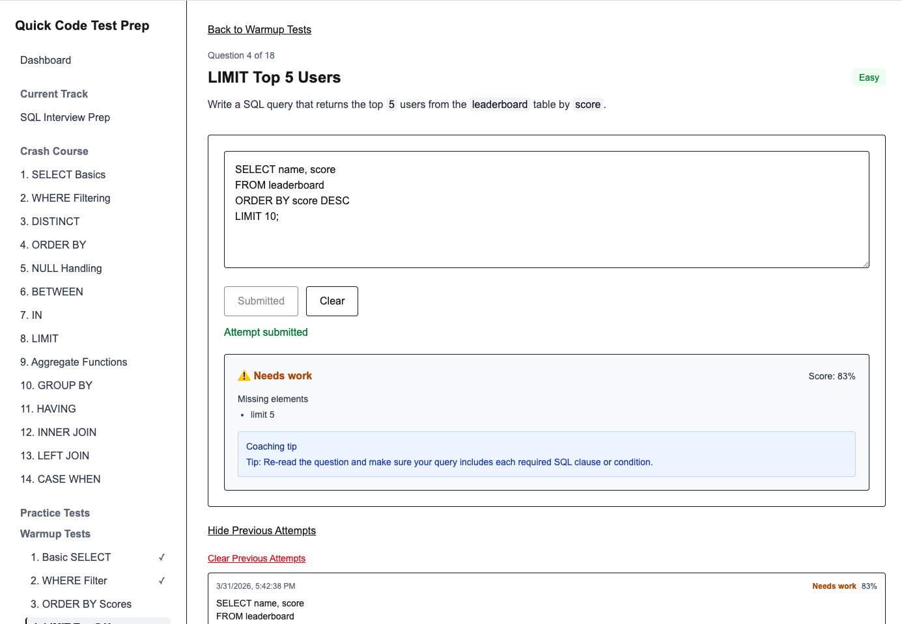

# Quick Code Test Prep

A lightweight interview prep platform for SQL and Python built with Next.js, Supabase, and deployed on Vercel.

## 🌐 Live Demo
[Quick Code Test Prep](https://quick-code-test-prep.vercel.app/)

[Live Demo](https://quick-code-test-prep.vercel.app/dashboard)



## 🧠 Why This Project Exists

This project started as an attempt to build a fast, focused interview-prep tool that helps candidates prepare for SQL and Python code tests in under 2 hours.

The core idea:
- Skip bloated platforms
- Focus on *signal* (what interviewers actually look for)
- Provide structured practice: Crash Course → Warmups → Timed Tests

After building and testing the concept, I concluded the market is already well-served by platforms such as DataLemur and W3Schools. 

However, the project became a valuable way to:

- Learn modern frontend architecture (Next.js + Vercel)
- Implement a real auth + data backend (Supabase)
- Explore AI-assisted development workflows
- Practice shipping and iterating quickly

## ⚙️ Tech Stack

- **Frontend**: Next.js (App Router), React, TypeScript
- **Backend**: Supabase (Postgres + Auth)
- **Deployment**: Vercel
- **Styling**: Tailwind
- **AI Assistance**: ChatGPT + Gemini + Claude Code (implementation + iteration)

## 🏗️ Architecture Overview

- Public marketing pages (no auth)
- Auth-gated app dashboard
- Learning tracks:
  - Crash Course (guided concepts)
  - Warmup Tests (untimed)
  - Timed Tests (interview simulation)
- Supabase handles:
  - User auth
  - Session storage
  - Test history

## ✨ Key Features

- Structured learning flow (not random question dumping)
- Warmups vs. timed modes (reduces anxiety vs. simulates pressure)
- Simple evaluation logic for SQL answers, covered by unit tests
- Session tracking for timed tests

## 🤖 AI-Assisted Development

AI tools were used to:
- Scaffold components and routes
- Generate and refine SQL and Python question sets
- Debug issues (React keys, state handling, etc.)
- Accelerate iteration

AI was *not* used blindly:
- Architecture decisions were human-driven
- Edge cases required manual reasoning
- UI/UX required iterative judgment

## 🧪 Testing

The SQL answer evaluation logic in `src/lib/sql-checker.ts` is covered by 26 Vitest unit tests. These tests verify that the checker correctly handles a range of SQL patterns — including normalization, keyword matching, structural comparisons, and edge cases.

To run the tests:

```bash
npm run test
```

## 📉 Why I Didn’t Pursue This Further

After building an MVP, I evaluated competitors and realized:
- The space is already saturated
- Existing platforms offer deeper question banks and brand trust
- Differentiation would require significantly more time and scope

Rather than continue, I chose to:
- Treat this as a learning + portfolio project
- Focus on communicating the build and decisions clearly

## 🚀 What I Learned

- How to structure a modern Next.js app (App Router, layouts, routing)
- How to integrate Supabase for auth + persistence
- How Vercel simplifies deployment and iteration
- Where AI accelerates development—and where it doesn’t
- The importance of validating product ideas early

## 🛠️ Local Setup

### 1. Clone and install npm (Node Package Manager)

```bash
git clone https://github.com/your-username/quick-code-test-prep.git
cd quick-code-test-prep
npm install
```
### 2. Create a Supabase project

1. Go to https://supabase.com.
2. Create a new project (free tier is sufficient).

### 3. Get your Supabase API keys

In Supabase:

1. Go to **Project Settings**.
2. Click **DATA API**, then copy the **API URL**.

    → You'll use this as `NEXT_PUBLIC_SUPABASE_URL`.

3. Click **API Keys**. Under **Publishable Key**, copy the **API KEY**. 

    → You'll use this as `NEXT_PUBLIC_SUPABASE_ANON_KEY`. 

    * If you are using a legacy anon API key:
      * Select **Legacy anon, service_role API keys**. 
      * Copy the **anon public** key.

> [!NOTE]
> Supabase recently updated its API key structure. Use the Publishable Key unless you specifically need legacy keys.


### 4. Create environment variables 

Create an `.env.local` file with:

```bash
NEXT_PUBLIC_SUPABASE_URL=your_API_URL
NEXT_PUBLIC_SUPABASE_ANON_KEY=your_API_KEY
```

### 5. Set up the database schema

Run the SQL query in [/src/db/schema.sql](src/db/schema.sql) in the Supabase SQL editor.

### 6. Create a test user in Supabase

This project uses a sign-in-only flow. Before logging in locally, create a user in your Supabase project:

1. In Supabase, go to **Authentication → Users**. 
2. Click **Add user**.
3. Create a demo user. For example:

    * Email: demo@quickprep.com
    * Password: demoprep

### 7. Run the app

```bash
npm run dev
```

Then open `http://localhost:3000` and log in using the demo user credentials. 

## License

MIT — see [LICENSE](./LICENSE)